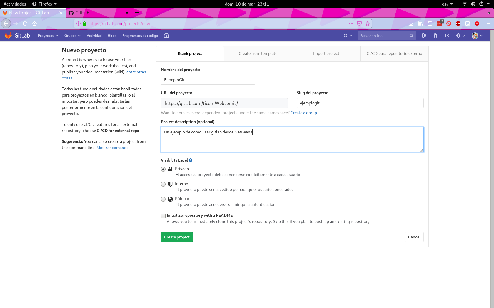
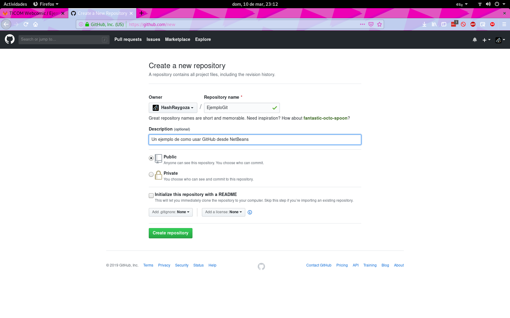
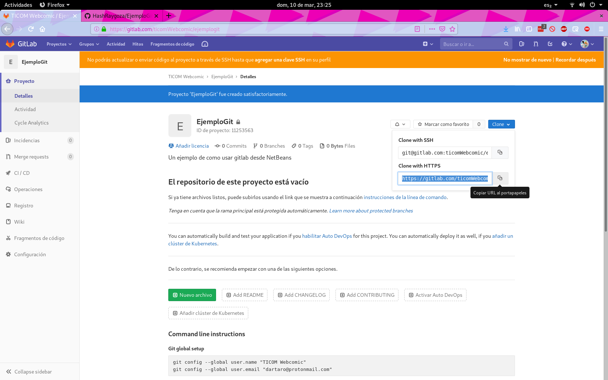
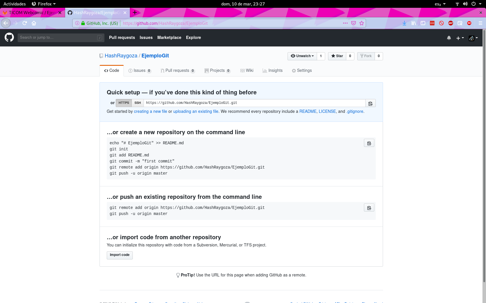
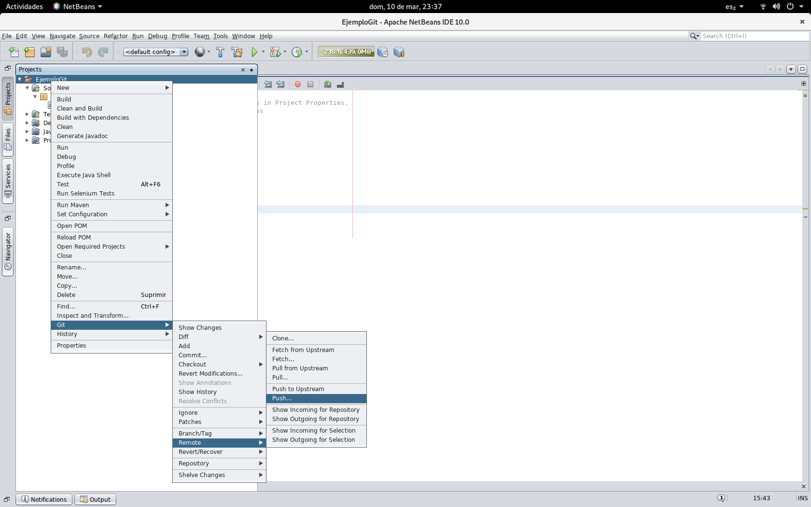
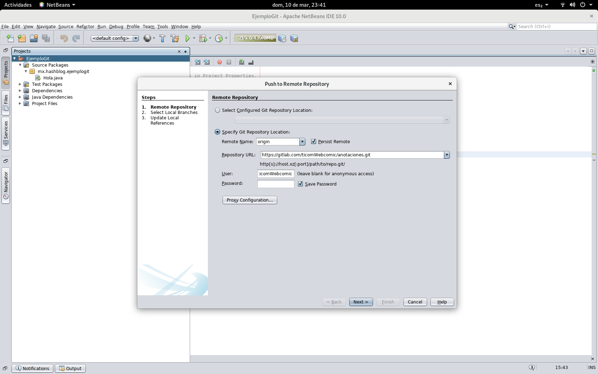
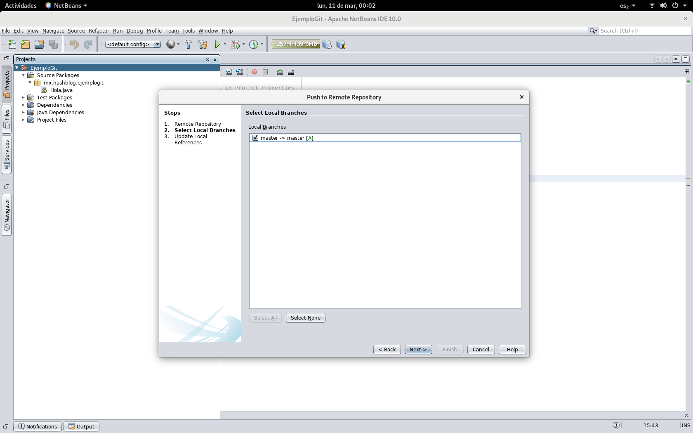
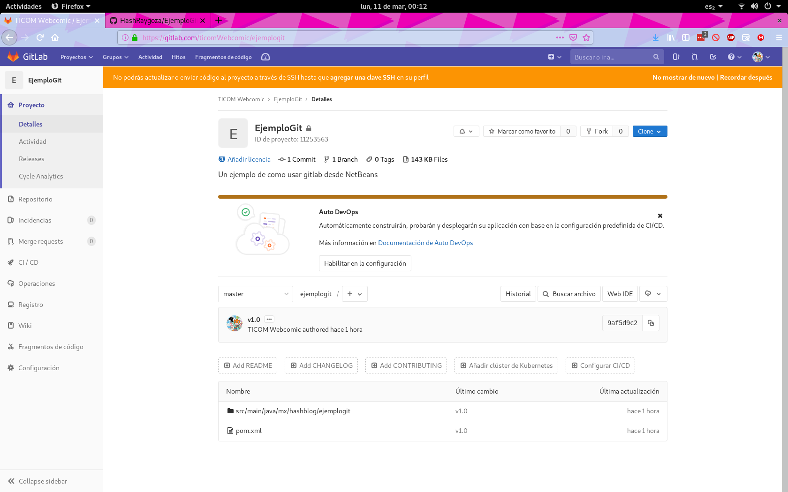
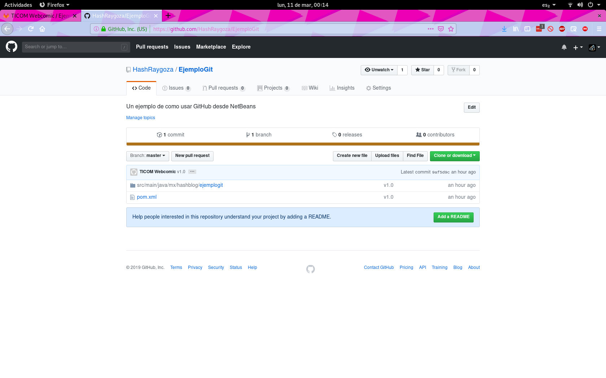

# Usando Github y GitLab desde NetBeans

OK, ya esta usando git como su control de versiones, con suerte la cantidad de carpetas _final, _nuevo, _nuevo_final ya se redujo a una cantidad mínima (mínimo ya dejaron de aparecer) ahora ¿Como usamos esto para trabajar en equipo y/o respaldar el código? una opción es usar una plataforma de desarrollo cooperativo o forja como lo son Github y GitLab ambas que podemos usar desde NetBeans.

## Crear repositorio remoto

El primer paso para usar esos servicios es subir nuestro proyecto, eso se conoce como Push en la jerga de Git y para subir un proyecto la primera vez se hace de la siguiente manera, el proceso es igual sin importar si usa GitHub o GitLab ,solo recuerde ya tener el sistema Git configurado y una cuenta ya sea en GitHub o Gitlab.

Hecho esto cree un nuevo repositorio en el servicio de su preferencia, puede ponerle el nombre que desee, la interfaz de como se crea un repositorio es similar en ambos servicios, pero en todo caso se muestran a continuación.

## Obtener URL de acceso

Ahora necesitamos el URL para acceder a ese repositorio, en el caso de Gitlab lo hallaremos en el botón clone, en la parte que dice "Clone with HTTPS"

Mientras que en el caso de GitHub el URL esta a la vista justo después de crear un repositorio.

## Configurar NetBeans

Ahora que tenemos la URL debemos indicarle a NetBeans que deseamos usar ese repositorio remoto, para esto presione el botón derecho sobre su proyecto y vaya al menú Git->Remote->Push.

Esto le presentara la interfaz para dar de alta un repositorio Git remoto, puede que le pida configurar una contraseña maestra, pero por el momento ignoraremos eso, el dialogo que le aparecerá sera como la siguiente figura

Aquí debe ingresar el nombre que quiera darle a ese repositorio remoto, como puede tener varios le recomiendo use algo descriptivo, la URL que acabamos de copiar como Repository URL y su usuario y contraseña.

Es posible saltarse esos últimos para acceso anónimo, pero usualmente eso solo le dejara hacer una copia local del repositorio, sin poder subir cambios.

Hecho esto damos siguiente y nos preguntara que rama del proyecto local deseamos se sincronice en el repositorio remoto, de nuevo si tiene mas de una rama y solo desea almacenar el trabajo hecha en una aquí es donde lo seleccionaría, en nuestro caso solo tenemos la rama master así que usaremos esa.

Ya seleccionada la rama damos siguiente y el proyecto se sincronizara en el repositorio remoto, esto se vera reflejado en la pagina del repositorio como puede verse a continuación.

Con esto debería bastarle para empezar, mínimo para hacer un respaldo bastante impresionante de su proyecto, pero obviamente hay muchas mas cosas que podemos hacer con NetBeans y los servicios Gitlab y GitHub, pero por el momento y para evitar que esta se haga una entrada demasiado larga lo dejaremos aquí, muy pronto veremos que mas se puede hacer.
